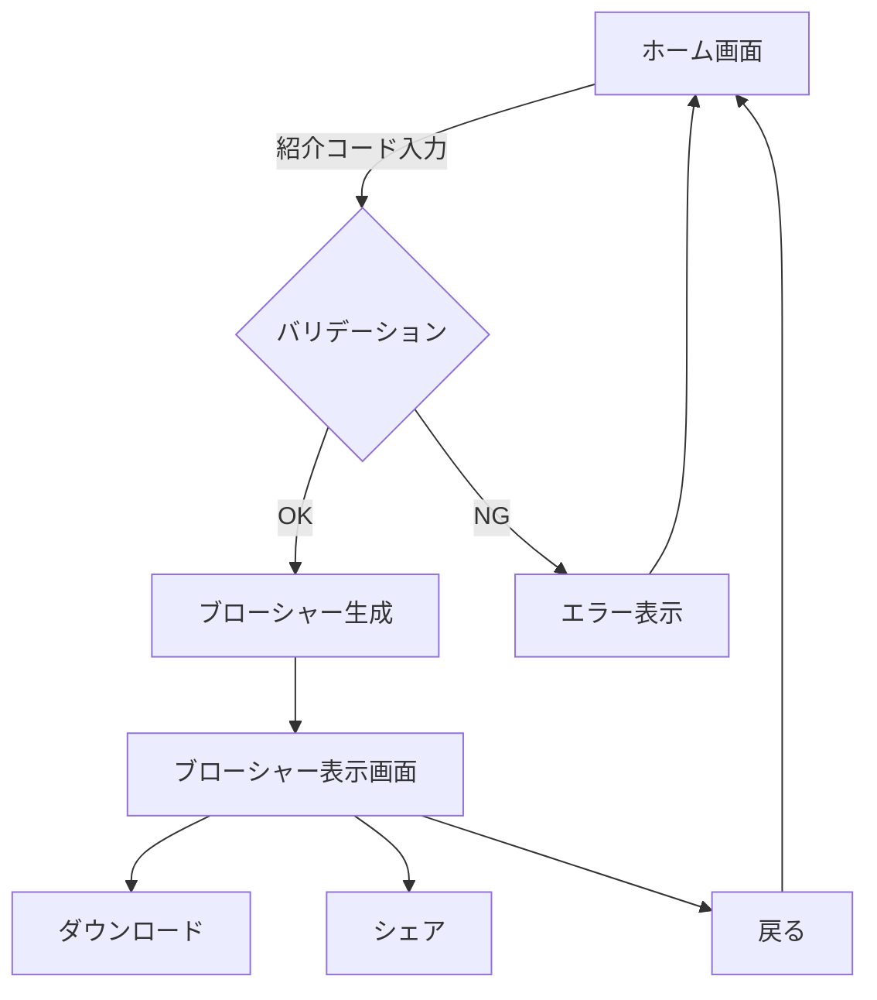

# KASTカードブローシャー生成システム 要件定義書

## 1. システム概要

### 1.1 目的
紹介コードを入力することで、個別化されたKASTカードの紹介ブローシャーを動的に生成し、リファラルURL・QRコードを含む画像を出力するWebアプリケーション。
表示される画面イメージは @PIC_Sample.png 

### 1.2 対象ユーザー
- KASTカードの既存ユーザー（紹介者）
- 紹介リンクを共有したいマーケター

### 1.3 技術スタック
- **フロントエンド**: Next.js 14+ (App Router), TypeScript, Tailwind CSS
- **画像生成**: Canvas API / html2canvas / @vercel/og
- **QRコード生成**: qrcode.react または qr-code-styling
- **デプロイ**: Vercel
- **状態管理**: React Context API / Zustand（必要に応じて）

---

## 2. 機能要件

### 2.1 紹介コード入力画面（ホーム画面）

#### 2.1.1 画面構成
- **ヘッダー**: KASTロゴ・タイトル
- **メインコンテンツ**:
  - 紹介コード入力フィールド（6-8文字の英数字）
  - バリデーションメッセージ表示エリア
  - "Brochure Create"ボタン
- **フッター**: 簡易的な説明文（オプション）

#### 2.1.2 入力仕様
| 項目 | 仕様 |
|------|------|
| フィールド名 | Referral Code |
| 形式 | 英数字（A-Z, a-z, 0-9） |
| 文字数 | 6-8文字 |
| 必須 | Yes |
| バリデーション | リアルタイム検証 |

#### 2.1.3 バリデーションルール
```typescript
interface ValidationRules {
  minLength: 6;
  maxLength: 8;
  pattern: /^[A-Za-z0-9]{6,8}$/;
  errorMessages: {
    empty: "紹介コードを入力してください";
    invalidFormat: "英数字6-8文字で入力してください";
    invalidLength: "6-8文字で入力してください";
  };
}
```

#### 2.1.4 画面遷移
- "Brochure Create"ボタン押下
  - バリデーション成功 → ブローシャー表示画面へ遷移
  - バリデーション失敗 → エラーメッセージ表示

---

### 2.2 ブローシャー表示画面

#### 2.2.1 画面構成
- **ベース画像**: @PIC_Template.png 
- **動的要素**:
  1. リファラルURL（テキスト）
  2. QRコード画像
  3. ダウンロードボタン
  4. Xシェアボタン（Xにポストする）
  5. 戻るボタン

#### 2.2.2 URL生成仕様
```typescript
interface ReferralURLConfig {
  baseURL: "https://go.kast.xyz/VqVO/";
  referralCode: string; // ユーザー入力値
  generatedURL: string; // baseURL + referralCode
}

// 例: https://go.kast.xyz/VqVO/SAPPORO
```

#### 2.2.3 QRコード生成仕様
| 項目 | 仕様 |
|------|------|
| 生成ライブラリ | qr-code-styling |
| サイズ | 200x200 px（画像上での配置に合わせて調整） |
| エラー訂正レベル | H (30%) |
| データ | generatedURL |
| スタイル | 白背景、黒ドット、角丸スタイル |
| 配置位置 | 画像右下（元画像と同じ位置） |

```typescript
interface QRCodeConfig {
  width: 200;
  height: 200;
  data: string; // generatedURL
  dotsOptions: {
    color: "#000000";
    type: "rounded";
  };
  backgroundOptions: {
    color: "#ffffff";
  };
  cornersSquareOptions: {
    type: "extra-rounded";
  };
  errorCorrectionLevel: "H";
}
```

#### 2.2.4 画像合成仕様
1. **ベース画像読み込み**: 既存のブローシャーデザイン
2. **Canvas描画**:
   - ベース画像を描画
   - URLテキストを指定位置にオーバーレイ
   - QRコードを指定位置にオーバーレイ
3. **出力形式**: PNG（JPEG可）

```typescript
interface CanvasOverlay {
  urlText: {
    position: { x: 700, y: 600 }; // 画像下部左側
    fontSize: "20px";
    fontFamily: "Arial, sans-serif";
    color: "#FFFFFF";
    text: string; // generatedURL
  };
  qrCode: {
    position: { x: 980, y: 450 }; // 画像右下
    size: { width: 200, height: 200 };
    image: HTMLImageElement;
  };
}
```

---

### 2.3 ダウンロード機能

#### 2.3.1 機能仕様
- **形式**: PNG
- **ファイル名**: `KAST_Brochure_[REFERRAL_CODE].png`
- **サイズ**: 元画像と同サイズ（1142x636 px）
- **トリガー**: "Download"ボタン押下

#### 2.3.2 実装方式
```typescript
// Canvas to Blob → Download
async function downloadBrochure(canvas: HTMLCanvasElement, referralCode: string) {
  const blob = await new Promise<Blob>((resolve) => 
    canvas.toBlob((blob) => resolve(blob!), 'image/png')
  );
  const url = URL.createObjectURL(blob);
  const link = document.createElement('a');
  link.href = url;
  link.download = `KAST_Brochure_${referralCode}.png`;
  link.click();
  URL.revokeObjectURL(url);
}
```

---

### 2.4 シェア機能（オプション）

#### 2.4.1 Web Share API対応
- モバイルデバイスでネイティブシェアシートを表示
- デスクトップではコピー機能を提供

```typescript
interface ShareData {
  title: "KAST Card Referral";
  text: "Join KAST with my referral code!";
  url: string; // generatedURL
}
```

---

## 3. 非機能要件

### 3.1 パフォーマンス
- **初期表示**: 2秒以内
- **画像生成時間**: 3秒以内
- **QRコード生成**: 1秒以内

### 3.2 レスポンシブデザイン
| デバイス | 画面幅 | レイアウト |
|---------|--------|----------|
| スマートフォン | 〜768px | 縦スクロール、画像幅100% |
| タブレット | 768-1024px | 中央配置 |
| デスクトップ | 1024px〜 | 中央配置、最大幅1200px |

### 3.3 ブラウザ対応
- Chrome 最新版
- Safari 最新版
- Firefox 最新版
- Edge 最新版

### 3.4 アクセシビリティ
- WCAG 2.1 Level AA準拠
- キーボード操作対応
- スクリーンリーダー対応（適切なARIA属性）

### 3.5 SEO
- メタタグ設定（OGP含む）
- シンプルなURL構造
- `sitemap.xml`生成

---

## 4. データ仕様

### 4.1 入力データ
```typescript
interface ReferralInput {
  referralCode: string; // 6-8文字英数字
  timestamp: Date; // 生成日時（オプション、ログ用）
}
```

### 4.2 出力データ
```typescript
interface BrochureOutput {
  imageBlob: Blob; // PNG画像
  referralURL: string; // 完全なURL
  qrCodeDataURL: string; // QRコードのData URL
  generatedAt: Date; // 生成日時
}
```

---

## 5. 画面フロー



---

## 6. API仕様

### 6.1 クライアントサイド生成（推奨）
APIを使わず、すべてクライアントサイドで処理。

### 6.2 サーバーサイドAPI（オプション）
将来的な拡張のため、Next.js Route Handlers使用。

#### 6.2.1 QRコード生成API
```
POST /api/generate-qr
Content-Type: application/json

Request:
{
  "url": "https://go.kast.xyz/VqVO/SAPPORO"
}

Response:
{
  "qrCodeDataURL": "data:image/png;base64,..."
}
```

#### 6.2.2 画像生成API（@vercel/og使用）
```
GET /api/og?code=SAPPORO

Response:
Image/PNG (dynamic OG image)
```

---

## 7. ファイル構成

```
kast-brochure/
├── app/
│   ├── page.tsx                    # ホーム画面（紹介コード入力）
│   ├── brochure/
│   │   └── [code]/
│   │       └── page.tsx            # ブローシャー表示画面
│   ├── api/
│   │   └── generate-qr/
│   │       └── route.ts            # QRコード生成API（オプション）
│   ├── layout.tsx                  # 共通レイアウト
│   └── globals.css                 # グローバルスタイル
├── components/
│   ├── ReferralCodeInput.tsx       # 紹介コード入力フォーム
│   ├── BrochureCanvas.tsx          # Canvas描画コンポーネント
│   ├── QRCodeGenerator.tsx         # QRコード生成
│   └── DownloadButton.tsx          # ダウンロードボタン
├── lib/
│   ├── validators.ts               # バリデーション関数
│   ├── canvas-utils.ts             # Canvas操作ユーティリティ
│   └── url-generator.ts            # URL生成ロジック
├── public/
│   └── images/
│       └── kast-brochure-base.png  # ベースブローシャー画像
├── types/
│   └── index.ts                    # TypeScript型定義
└── package.json
```

---

## 8. 技術実装詳細

### 8.1 必要なパッケージ
```json
{
  "dependencies": {
    "next": "^14.0.0",
    "react": "^18.2.0",
    "react-dom": "^18.2.0",
    "typescript": "^5.0.0",
    "qr-code-styling": "^1.6.0",
    "html2canvas": "^1.4.1"
  },
  "devDependencies": {
    "@types/node": "^20.0.0",
    "@types/react": "^18.2.0",
    "tailwindcss": "^3.3.0",
    "autoprefixer": "^10.4.0",
    "postcss": "^8.4.0"
  }
}
```

### 8.2 Canvas描画ロジック
```typescript
// lib/canvas-utils.ts
export async function generateBrochure(
  baseImageUrl: string,
  referralCode: string
): Promise<HTMLCanvasElement> {
  const canvas = document.createElement('canvas');
  const ctx = canvas.getContext('2d')!;
  
  // ベース画像読み込み
  const baseImage = await loadImage(baseImageUrl);
  canvas.width = baseImage.width;
  canvas.height = baseImage.height;
  
  // ベース画像描画
  ctx.drawImage(baseImage, 0, 0);
  
  // URL生成と描画
  const referralURL = `https://go.kast.xyz/VqVO/${referralCode}`;
  ctx.font = '20px Arial';
  ctx.fillStyle = '#FFFFFF';
  ctx.fillText(referralURL, 700, 600);
  
  // QRコード生成と描画
  const qrCode = await generateQRCode(referralURL);
  const qrImage = await loadImage(qrCode);
  ctx.drawImage(qrImage, 980, 450, 200, 200);
  
  return canvas;
}

async function loadImage(src: string): Promise<HTMLImageElement> {
  return new Promise((resolve, reject) => {
    const img = new Image();
    img.onload = () => resolve(img);
    img.onerror = reject;
    img.src = src;
  });
}
```

### 8.3 QRコード生成ロジック
```typescript
// lib/qr-generator.ts
import QRCodeStyling from 'qr-code-styling';

export async function generateQRCode(url: string): Promise<string> {
  const qrCode = new QRCodeStyling({
    width: 200,
    height: 200,
    data: url,
    dotsOptions: {
      color: '#000000',
      type: 'rounded',
    },
    backgroundOptions: {
      color: '#ffffff',
    },
    cornersSquareOptions: {
      type: 'extra-rounded',
    },
    errorCorrectionLevel: 'H',
  });
  
  const blob = await qrCode.getRawData('png');
  return URL.createObjectURL(blob!);
}
```

### 8.4 バリデーション
```typescript
// lib/validators.ts
export interface ValidationResult {
  isValid: boolean;
  error?: string;
}

export function validateReferralCode(code: string): ValidationResult {
  if (!code || code.trim() === '') {
    return { isValid: false, error: '紹介コードを入力してください' };
  }
  
  if (code.length < 6 || code.length > 8) {
    return { isValid: false, error: '6-8文字で入力してください' };
  }
  
  if (!/^[A-Za-z0-9]+$/.test(code)) {
    return { isValid: false, error: '英数字のみ使用できます' };
  }
  
  return { isValid: true };
}
```

---

## 9. セキュリティ要件

### 9.1 入力サニタイゼーション
- XSS対策: 入力値をエスケープ処理
- SQLインジェクション対策: 不要（DBアクセスなし）

### 9.2 レート制限
- 同一IPからの連続リクエスト制限（オプション）
- Vercel Edge Functionsの制限内で動作

### 9.3 HTTPS強制
- Vercel自動設定により全通信HTTPS化

---

## 10. デプロイメント

### 10.1 Vercel設定
```json
// vercel.json
{
  "buildCommand": "npm run build",
  "outputDirectory": ".next",
  "framework": "nextjs",
  "regions": ["hnd1"]
}
```

### 10.2 環境変数
```bash
# .env.local
NEXT_PUBLIC_BASE_REFERRAL_URL=https://go.kast.xyz/VqVO/
```

### 10.3 ビルド最適化
- 画像最適化: Next.js Image Optimization
- コード分割: Dynamic Imports
- CDN配信: Vercel Edge Network

---

## 11. テスト要件

### 11.1 単体テスト
- バリデーション関数テスト
- URL生成ロジックテスト
- QRコード生成テスト

### 11.2 統合テスト
- エンドツーエンド画面フロー
- 画像生成プロセス全体

### 11.3 クロスブラウザテスト
- Chrome, Safari, Firefox, Edge
- モバイルブラウザ（iOS Safari, Chrome Mobile）

---

## 12. 運用・保守

### 12.1 ログ
- エラーログ: Vercel Analytics
- アクセスログ: Vercel Analytics Dashboard

### 12.2 監視
- Uptime監視: Vercel自動監視
- パフォーマンス監視: Core Web Vitals

### 12.3 バックアップ
- コードベース: Git（GitHub/GitLab）
- 静的アセット: Vercel Storage

---

## 13. 今後の拡張案

### 13.1 Phase 2機能
- リファラル統計ダッシュボード
- カスタムデザインテンプレート選択
- 多言語対応

### 13.2 Phase 3機能
- ユーザー認証・ログイン
- 生成履歴保存
- ソーシャルシェア最適化

---

## 14. 付録

### 14.1 参考URL
- KAST公式: `https://kast.xyz`
- リファラルベースURL: `https://go.kast.xyz/VqVO/`

### 14.2 関連ドキュメント
- Next.js Documentation: https://nextjs.org/docs
- Vercel Deployment Guide: https://vercel.com/docs
- QR Code Styling: https://github.com/kozakdenys/qr-code-styling

---

**作成日**: 2025-11-10  
**バージョン**: 1.0  
**承認**: [承認者名]
